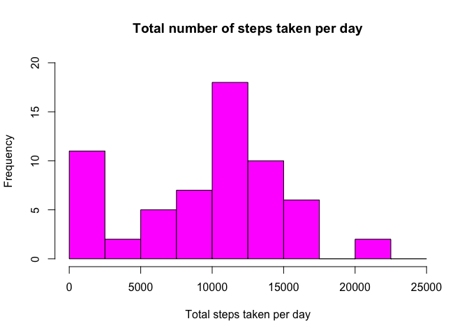
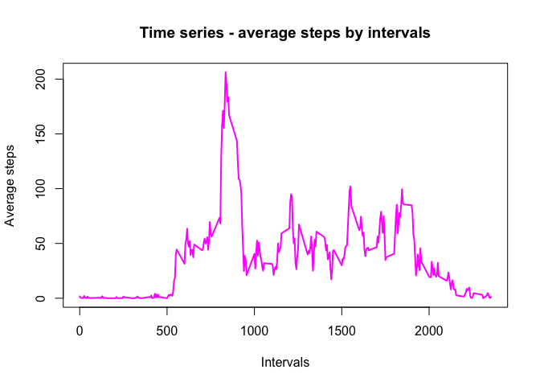
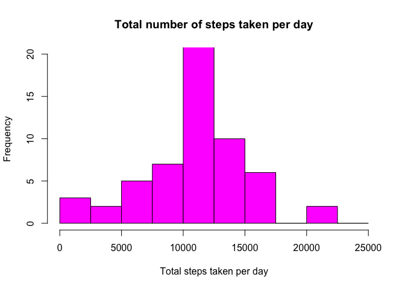
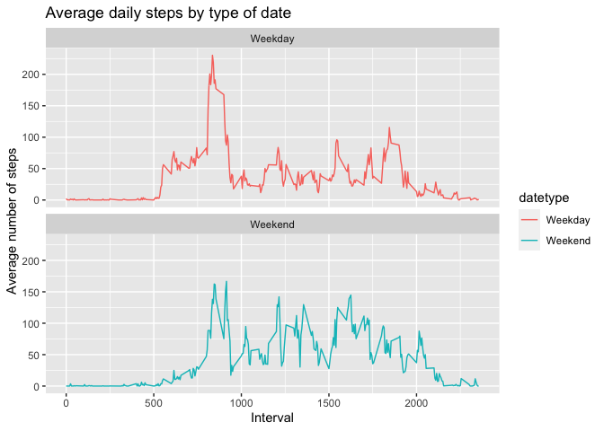

## Loading and preprocessing the data


```r
library(dplyr)
library(lubridate)
library(ggplot2)
```

Unziping the file. 


```r
if (!dir.exists("data")){
  dir.create("data")
}

if (!file.exists("activity.csv")){
  unzip("activity.zip", exdir = getwd())
}
```

Reading the data


```r
data0<- read.csv("activity.csv", header = TRUE)
```

Transforming the "date" column into Date class.


```r
data0$date <- ymd(data0$date)
```

Let's take a look at the data.


```r
head(data0)
```

```
##   steps       date interval
## 1    NA 2012-10-01        0
## 2    NA 2012-10-01        5
## 3    NA 2012-10-01       10
## 4    NA 2012-10-01       15
## 5    NA 2012-10-01       20
## 6    NA 2012-10-01       25
```

## What is mean total number of steps taken per day?

Calculate the total number of steps taken per day


```r
total_steps_day <- data0 %>% group_by(date) %>% 
  summarize(steps_day = sum(steps, na.rm = TRUE))

head(total_steps_day)
```

```
## # A tibble: 6 x 2
##   date       steps_day
##   <date>         <int>
## 1 2012-10-01         0
## 2 2012-10-02       126
## 3 2012-10-03     11352
## 4 2012-10-04     12116
## 5 2012-10-05     13294
## 6 2012-10-06     15420
```

Make a histogram of the total number of steps taken each day


```r
hist(total_steps_day$steps_day, 
     main = "Total number of steps taken per day", 
     xlab = "Total steps taken per day", 
     col = "magenta", 
     ylim = c(0,20), 
     breaks = seq(0,25000, by=2500))
```

<!-- -->

Calculate and report the mean of the total number of steps taken per day


```r
mean(total_steps_day$steps_day)
```

```
## [1] 9354.23
```

Calculate and report the median of the total number of steps taken per day


```r
median(total_steps_day$steps_day)
```

```
## [1] 10395
```

## What is the average daily activity pattern?

Calculating the averaged daily steps


```r
average_daily_steps <- aggregate(data0$steps, 
                                 by=list(data0$interval), 
                                 mean, 
                                 na.rm=TRUE)

names(average_daily_steps) <- c("interval", "average.steps")

head(average_daily_steps)
```

```
##   interval average.steps
## 1        0     1.7169811
## 2        5     0.3396226
## 3       10     0.1320755
## 4       15     0.1509434
## 5       20     0.0754717
## 6       25     2.0943396
```

Make a time series plot of the 5-minute interval and the average number of steps taken, averaged across all days.


```r
plot(average_daily_steps$interval, average_daily_steps$average.steps, 
     type="l", 
     main = "Time series - average steps by intervals", 
     xlab= "Intervals", 
     ylab="Average steps", 
     lwd=2, 
     col="magenta")
```

<!-- -->

Which 5-minute interval, on average across all the days in the dataset, contains the maximum number of steps?


```r
average_daily_steps[which.max(average_daily_steps$average.steps), ]$interval
```

```
## [1] 835
```

## Imputing missing values

Calculate and report the total number of missing values in the dataset (i.e. the total number of rows with NAs.


```r
sum(is.na(data0$steps))
```

```
## [1] 2304
```

Devise a strategy for filling in all of the missing values in the dataset. The strategy does not need to be sophisticated. For example, you could use the mean/median for that day, or the mean for that 5-minute interval, etc.

Let's create a function that will retain the mean value for each interval.


```r
get.mean.value <- function(interval){
  average_daily_steps[average_daily_steps$interval == interval, ]$average.steps
}
```

Create a new dataset that is equal to the original dataset but with the missing data filled in.


```r
data1 <- data0

for (i in 1:nrow(data1)){
    if(is.na(data1[i,]$steps)){
        data1[i,]$steps <- get.mean.value(data1[i,]$interval)
    }
}

head(data1)
```

```
##       steps       date interval
## 1 1.7169811 2012-10-01        0
## 2 0.3396226 2012-10-01        5
## 3 0.1320755 2012-10-01       10
## 4 0.1509434 2012-10-01       15
## 5 0.0754717 2012-10-01       20
## 6 2.0943396 2012-10-01       25
```

```r
sum(is.na(data1$steps))
```

```
## [1] 0
```

Calculate the total number of steps taken per day in the new data with no missing values.


```r
total_steps_day_data1 <- data1 %>% group_by(date) %>% 
  summarize(steps_day = sum(steps, na.rm = TRUE))

head(total_steps_day_data1)
```

```
## # A tibble: 6 x 2
##   date       steps_day
##   <date>         <dbl>
## 1 2012-10-01    10766.
## 2 2012-10-02      126 
## 3 2012-10-03    11352 
## 4 2012-10-04    12116 
## 5 2012-10-05    13294 
## 6 2012-10-06    15420
```

Make a histogram of the total number of steps taken each day and Calculate and report the mean and median total number of steps taken per day.


```r
hist(total_steps_day_data1$steps_day, 
     main = "Total number of steps taken per day", 
     xlab = "Total steps taken per day", 
     col = "magenta", 
     ylim = c(0,20), 
     breaks = seq(0,25000, by=2500))
```

<!-- -->

Calculate and report the mean of the total number of steps taken per day


```r
mean(total_steps_day_data1$steps_day)
```

```
## [1] 10766.19
```

Calculate and report the median of the total number of steps taken per day


```r
median(total_steps_day_data1$steps_day)
```

```
## [1] 10766.19
```

Do these values differ from the estimates from the first part of the assignment? 
Let's take a look at the two different means. 


```r
mean1 <- mean(total_steps_day$steps_day) #with NA values
mean2 <- mean(total_steps_day_data1$steps_day) #without NA values
percentage.diff.mean <- (mean2*100/mean1)-100
percentage.diff.mean
```

```
## [1] 15.09434
```

Let's take a look at the two different medians. 


```r
median1 <- median(total_steps_day$steps_day) #with NA values
median2 <- median(total_steps_day_data1$steps_day) #without NA values
percentage.diff.median <- (median2*100/median1)-100
percentage.diff.median
```

```
## [1] 3.570839
```

What is the impact of imputing missing data on the estimates of the total daily number of steps?

With inputed values, the mean went up by 15% and the median went up by 3.5%

## Are there differences in activity patterns between weekdays and weekends?

Let's include a new column (weekday) in the dataset.


```r
weekday <- weekdays(data1$date)
data1 <- cbind(data1,weekday)
head(data1)
```

```
##       steps       date interval weekday
## 1 1.7169811 2012-10-01        0  Monday
## 2 0.3396226 2012-10-01        5  Monday
## 3 0.1320755 2012-10-01       10  Monday
## 4 0.1509434 2012-10-01       15  Monday
## 5 0.0754717 2012-10-01       20  Monday
## 6 2.0943396 2012-10-01       25  Monday
```

Create a new factor variable in the dataset with two levels – “weekday” and “weekend” indicating whether a given date is a weekday or weekend day.


```r
data1$datetype <- sapply(data1$date, function(x) {
        if (weekdays(x) == "Saturday" | weekdays(x) =="Sunday") 
                {y <- "Weekend"} else 
                {y <- "Weekday"}
                y
        })

head(data1)
```

```
##       steps       date interval weekday datetype
## 1 1.7169811 2012-10-01        0  Monday  Weekday
## 2 0.3396226 2012-10-01        5  Monday  Weekday
## 3 0.1320755 2012-10-01       10  Monday  Weekday
## 4 0.1509434 2012-10-01       15  Monday  Weekday
## 5 0.0754717 2012-10-01       20  Monday  Weekday
## 6 2.0943396 2012-10-01       25  Monday  Weekday
```

```r
str(data1)
```

```
## 'data.frame':	17568 obs. of  5 variables:
##  $ steps   : num  1.717 0.3396 0.1321 0.1509 0.0755 ...
##  $ date    : Date, format: "2012-10-01" "2012-10-01" ...
##  $ interval: int  0 5 10 15 20 25 30 35 40 45 ...
##  $ weekday : chr  "Monday" "Monday" "Monday" "Monday" ...
##  $ datetype: chr  "Weekday" "Weekday" "Weekday" "Weekday" ...
```

Make a panel plot containing a time series plot of the 5-minute interval and the average number of steps taken, averaged across all weekday days or weekend days.


```r
steps_by_date <- aggregate(steps~interval + datetype, data1, mean, na.rm = TRUE)

plot<- ggplot(steps_by_date, aes(x = interval , y = steps, color = datetype)) +
       geom_line() +
       labs(title = "Average daily steps by type of date", x = "Interval", y = "Average number of steps") +
       facet_wrap(~datetype, ncol = 1, nrow=2)
print(plot)
```

<!-- -->


